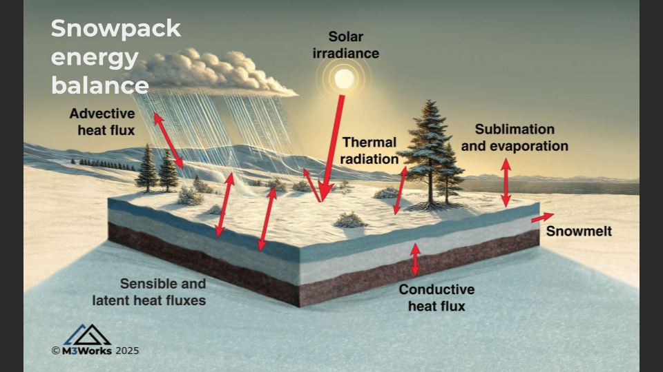

# PointSnobal

Python wrapped implementation of the Snobal model applied at a point. 

The code in `pointsnobal/c_snobal` is the same underlying algorithms described
in [A spatially distributed energy balance snowmelt model for application in mountain basins (Marks 1999)]( https://doi.org/10.1002/(SICI)1099-1085(199909)13:12/13<1935::AID-HYP868>3.0.CO;2-C),
which details iSnobal. This code was originally available in IPW. 

This software takes in a csv of HOURLY input data and writes a csv of daily snowpack
data.



## Research API
🚀 Calling Snow Researchers & Students! 🚀

At M3 Works, we’re passionate about advancing scientific research and education! 🌍📊

That’s why we offer free access to our PointSnobal API for qualifying
research and educational projects. Whether you’re modeling snow processes
or exploring hydrology, we’re here to support your work!

🔑 Request an API key on our website -> [https://m3works.io/contact](https://m3works.io/contact)

Let’s collaborate and push the boundaries of environmental modeling together! ❄️📡

### Disclaimer
This API is provided under the same license listed in this directory. The API
and code are provided “as is”, and M3 Works LLC makes no guarantees of functionality, performance, or fitness for any particular purpose.

M3 Works LLC shall not be held liable for any direct, indirect, incidental, or consequential damages arising from the use or inability to use this API or its associated code.

Use of this API constitutes acceptance of the terms and conditions outlined in the accompanying license.

### API usage
Example of api usage in python
```python
from pathlib import Path
import requests
import pandas as pd

api_key = "<your key>"
api_id = "bktiz24e19"
file_path = Path("<path to your input csv file>")
elevation = 1000  # your point elevation in meters
url = f"https://{api_id}.execute-api.us-west-2.amazonaws.com/m3works/snobal"
params = {"elevation": elevation}

output_file_name = file_path.name.replace('inputs', 'snobal')
output_file = file_path.parent.joinpath(output_file_name)

# Headers
headers = {
    "x-api-key": api_key,
    "Content-Type": "text/csv"
}

print("Reading file and calling API")
# Load the CSV file as binary data
with open(str(file_path), "rb") as file:
    response = requests.post(
        url, headers=headers, params=params, data=file)

print("API request finished")
# error if we failed
response.raise_for_status()

result = response.json()

print("Parsing results")
# Get result into pandas
df = pd.DataFrame.from_dict(result['results']["data"])
```

## Running locally
### Script usage
Use `scripts/use_api.py` to call the api from the command line

```bash
python3 scripts/use_api.py <path to your file>  \
<your point elevation> --api_key <your api key>
```

This will output a csv file of the results.
Run `python3 scripts/use_api.py --help` for a full list of options.

## Input files

### Variables that inform **snobal**
These variables are directly used within snobal
 * `air_temp` - modeled air temp at 2m above ground
 * `percent_snow` - % mix of snow vs rain (1 == all snow) [decimal percent]
 * `precip` - precipitation mass [mm]
 * `precip_temp` - wet bulb temperature
 * `snow_density` - density of the NEW snow that hour [kg/m^3]
 * `vapor_pressure` - modeled vapor pressure
 * `wind_speed` - Wind speed at 5m above ground [m/s]
 * `soil_temp` - Average temperature of the soil column down to 30cm
 * `net_solar` - net solar into the snowpack [w/m^2]
 * `thermal` - net longwave radiation into the snowpack [w/m^2]

See `./tests/data/inputs_csl_2023.csv` for an example of data format

## Height settings for **snobal**
 * wind height: 5m
 * air temp height: 2m
 * soil temp depth: 0.3m

## Watch out for
 * Snobal expects temperatures to be in Kelvin. This code expects Celcius.
  We do the conversion in `get_timestep_force`
 * Precip mass (`precip`) is a big driver here. Without accurate conditions,
    model results will be poor

## PointSnobal script
The entrypoint is `make_snow` once installed.
Example:
```bash
make_snow <path to input file> <elevation in meters>
```

## Install

### Requirements
Requirements can be found in `requirements.txt`
**NOTE** - GCC is required

For local build: 
Create a virtual environment to isolate the code
```bash
pip install -r requirements.txt
python3 setup.py build_ext --inplace
```

### Install issues on mac
If you're getting `'omp.h' file not found` on `setup.py install`

This can fix that issue

```shell
export CC=/usr/local/bin/gcc-14
```
for M1 or M2 mac this would be
```shell
export CC=/opt/homebrew/bin/gcc-14
```
This was *after* `brew install gcc` to get a version with openmp
On M2 mac I also had to run `brew install libomp`

Then I had the error `ld: library not found for -lomp` which I fixed with
```
export LDFLAGS="-L/usr/local/opt/libomp/lib"
```

for M1 and M2 this would be
```shell
export LDFLAGS="-L/opt/hombrew/Cellar/libomp/lib"
```
or
```shell
export LDFLAGS="-L/opt/homebrew/opt/libomp/lib"
```
depending on the path. You can find that path with `brew info libomp`

## Validation data
Using [metloom](https://github.com/M3Works/metloom) for station data that
can be used for validation. `get_daily_data` returns a GeoPandas DataFrame
of the variables and units on a daily timestep. Validation is crucial in 
snowpack modeling!

```python
# Imports
import pandas as pd
from metloom.pointdata import CDECPointData
from metloom.variables import CdecStationVariables

# Specify start and end date
start_date = pd.to_datetime("2019-10-01")
end_date = pd.to_datetime("2020-06-01")

# List of variables to request
desired_variables = [
    CdecStationVariables.SWE, CdecStationVariables.SNOWDEPTH
]

# Define the point
point = CDECPointData("GRV", "Graveyard Meadow")

# Request the data
df = point.get_daily_data(
    start_date, end_date, desired_variables
)
# Data comes back indexed on `datetime` and `site`, reset to just datetime
df = df.reset_index().set_index("datetime")
# Show the results
print(df)
# store in csv if you want
df.to_csv(f"{point.id}_station_data.csv", index_label="datetime")

```
