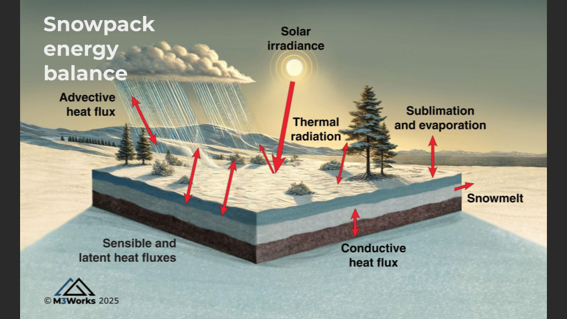

# PointSnobal
[](https://zenodo.org/records/22216123)

Python wrapped implementation of the Snobal model applied at a point.

The code in `pointsnobal/c_snobal` is the same underlying algorithms described
in [A spatially distributed energy balance snowmelt model for application in mountain basins (Marks 1999)]( https://doi.org/10.1002/(SICI)1099-1085(199909)13:12/13<1935::AID-HYP868>3.0.CO;2-C),
which details Snobal. This code was originally available in IPW.

This software takes in a csv of **HOURLY** input data and writes a csv of daily snowpack
data.



## Versions

PointSnobal ships in versioned lines:

| Version | Description |
| --- | --- |
| `v0.1.x` | The legacy USDA ARS Snobal, maintained to build and run on modern systems. |

## Research API
🚀 Calling Snow Researchers & Students! 🚀

At M3 Works, we’re passionate about advancing scientific research and education! 🌍📊

That’s why we offer free access to our PointSnobal API for qualifying
research and educational projects. Whether you’re modeling snow processes
or exploring hydrology, we’re here to support your work!

🔑 Request an API key on our website -> [https://m3works.io/contact](https://m3works.io/contact)

Let’s collaborate and push the boundaries of environmental modeling together! ❄️📡

### Credit
If you use the pointsnobal API we ask that you credit M3Works. To cite, please use the following 
DOI:

https://zenodo.org/records/14814813


### Disclaimer
This API is provided under the same license listed in this directory. The API
and code are provided “as is”, and M3 Works LLC makes no guarantees of functionality, performance, or fitness for any particular purpose.

M3 Works LLC shall not be held liable for any direct, indirect, incidental, or consequential damages arising from the use or inability to use this API or its associated code.

Use of this API constitutes acceptance of the terms and conditions outlined in the accompanying license.

### API usage
Example of api usage in python
```python
from pathlib import Path
import requests
import pandas as pd

api_key = "<your key>"
api_id = "bktiz24e19"
file_path = Path("<path to your input csv file>")
elevation = 1000  # your point elevation in meters (REQUIRED)
url = f"https://{api_id}.execute-api.us-west-2.amazonaws.com/m3works/snobal"
# Query parameters. Only `elevation` is required; the others are optional and
# shown here at their defaults. z_u / z_t / z_g are measurement heights in
# meters, relative to the snow surface.
params = {
    "elevation": elevation,       # REQUIRED - point elevation (m)
    "z_u": 5.0,                   # wind speed measurement height (m)
    "z_t": 2.0,                   # air temperature measurement height (m)
    "z_g": 0.3,                   # soil temperature depth (m)
    "output_frequency": "daily",  # "daily" (one row per day) or "hourly"
}

output_file_name = file_path.name.replace('inputs', 'snobal')
output_file = file_path.parent.joinpath(output_file_name)

# Headers
headers = {
    "x-api-key": api_key,
    "Content-Type": "text/csv"
}

print("Reading file and calling API")
# Load the CSV file as binary data
with open(str(file_path), "rb") as file:
    response = requests.post(
        url, headers=headers, params=params, data=file)

print("API request finished")
# error if we failed
response.raise_for_status()

result = response.json()

print("Parsing results")
# Get result into pandas
df = pd.DataFrame.from_dict(result['results']["data"])
```

## Running locally
### Script usage
Use `scripts/use_api.py` to call the api from the command line

```shell
python3 scripts/use_api.py <path to your file>  \
<your point elevation> --api_key <your api key>
```

This will output a csv file of the results.
Run `python3 scripts/use_api.py --help` for a full list of options.

## Input files

### Variables that inform **Snobal**
These variables are directly used within Snobal
 * `air_temp` - modeled air temp at 2m above ground
 * `percent_snow` - % mix of snow vs rain (1 == all snow) [decimal percent]
 * `precip` - precipitation mass [mm]
 * `precip_temp` - wet bulb temperature
 * `snow_density` - density of the NEW snow that hour [kg/m^3]
 * `vapor_pressure` - modeled vapor pressure
 * `wind_speed` - Wind speed at 5m above ground [m/s]
 * `soil_temp` - Average temperature of the soil column down to 30cm
 * `net_solar` - Net solar into the snowpack [w/m^2]
 * `thermal` - Incoming longwave radiation into the snowpack [w/m^2]

See `./tests/data/inputs_csl_2023.csv` for an example of data format

### Measurement heights
Heights are relative to the snow surface and default to the values below.
Override them per run with the `z_u` / `z_t` / `z_g` parameters — as API query
parameters (above), or on the CLI with `make_snow --z_u/--z_t/--z_g`.

 * `z_u` — wind speed measurement height (default 5 m)
 * `z_t` — air temperature measurement height (default 2 m)
 * `z_g` — soil temperature depth (default 0.3 m)

> [!IMPORTANT]
> Watch out for...
> * Snobal expects temperatures to be in Kelvin. This code expects Celsius.
>   We do the conversion in `get_timestep_force`
> * Precip mass (`precip`) is a big driver here. Without accurate conditions,
>   model results will be poor


## Local Install
> [!TIP]
> Creating a local virtual environment with your tool of choice is recommended to isolate your code
> prior to installation.

### Download Code
Navigate to a directory where you would like to download the repo, for example a `projects` directory in your home, and
clone the repository.

```shell
cd ~/projects
git clone git@github.com:M3Works/pointsnobal.git
cd pointsnobal
```

### Requirements


Requirements can be found in `requirements.txt`.

> [!NOTE]
> A C-compiler with OpenMP support is required, on linux this is generally available. On macOS using [Homebrew](https://brew.sh/) is a simple option.
> ```shell
> brew install gcc libomp
> ```

For local build:
```shell
pip install -r requirements.txt
python3 setup.py build_ext --inplace
python3 install .
```

### PointSnobal script
The entrypoint is `make_snow` once installed:

```shell
make_snow <path to input file> <elevation in meters>
```

For example, the installation can be quickly verified by running the test problem.

```shell
make_snow ./tests/data/inputs_csl_2023.csv 2101 --output_file test.csv
```


## Validation data
Using [metloom](https://github.com/M3Works/metloom) for station data that
can be used for validation. `get_daily_data` returns a GeoPandas DataFrame
of the variables and units on a daily timestep. Validation is crucial in
snowpack modeling!

```python
# Imports
import pandas as pd
from metloom.pointdata import CDECPointData
from metloom.variables import CdecStationVariables

# Specify start and end date
start_date = pd.to_datetime("2019-10-01")
end_date = pd.to_datetime("2020-06-01")

# List of variables to request
desired_variables = [
    CdecStationVariables.SWE, CdecStationVariables.SNOWDEPTH
]

# Define the point
point = CDECPointData("GRV", "Graveyard Meadow")

# Request the data
df = point.get_daily_data(
    start_date, end_date, desired_variables
)
# Data comes back indexed on `datetime` and `site`, reset to just datetime
df = df.reset_index().set_index("datetime")
# Show the results
print(df)
# store in csv if you want
df.to_csv(f"{point.id}_station_data.csv", index_label="datetime")

```

## Troubleshoting

### Install issues on macOS
If you are getting `'omp.h' file not found` or `ld: library not found for -lomp` during the
`setup.py build_ext` step you need to be sure that the correct compiler is being utilized and the OpenMP libraries are available.

First, set the `CC` environment variable to your C-compiler. For example, the following
is are the paths used on macOS when using homebrew.

```shell
export CC=/usr/local/bin/gcc-14 # Intel
export CC=/opt/homebrew/bin/gcc-14 # Apple silicon
```

Second, be sure the OpenMP libraries are available to the compiler. This can
be accomplished by setting the `LDFLAGS` envornment variable. For example, for
`libomp` install with homebrew.

```shell
export LDFLAGS="-L/opt/homebrew/opt/libomp/lib" # Intel
export LDFLAGS="-L/opt/hombrew/Cellar/libomp/lib" # Apple silicon
```

For additional help on these path, when using homebrew, utilize the `brew info gcc` and `brew info libomp`commands.
